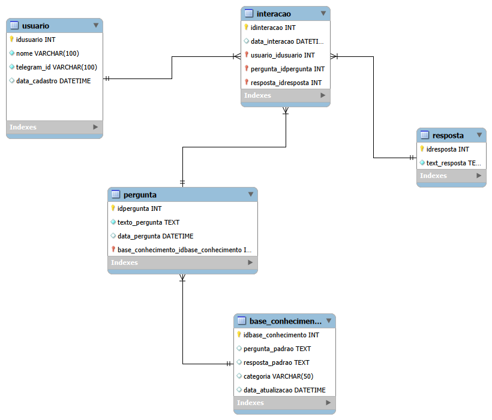

#PROJETO 01

 ## DOCUMENTAÇÃO DE REQUISITOS
 
##  Introdução
  Esta documentação apresenta o desenvovimento do Chatbot FAQ Acadêmico, com o objetivo de facilitar o acesso dos alunos da UFPA/Campus Cametá a informações acadêmicas de forma rápida e automatizada. O sistema busca reduzir a dependência de atendimentos manuais, oferecendo respostas automáticas para dúvidas frequentes relacionadas a matrícula, calendário acadêmico, secretaria, disciplinas, cursos, estágios, biblioteca, TCC e uso de sistemas institucionais, como o SIGAA.  
  O chatbot funciona por meio da integração com o Telegram, permitindo que os usuários realizem consultas de maneira simples e acessível. Para o processamento das mensagens e organização dos fluxos de atendimento, é utilizada a ferramenta n8n, enquanto o banco de dados PostgreSQL é responsável pelo armazenamento da base de conhecimento e pelo registro das interações realizadas.
  Ao longo deste documento são descritos os requisitos funcionais e não funcionais do sistema, bem como a modelagem por meio do diagrama de caso de uso e o diagrama de entidade-relacionamento, possibilitando uma visão geral do funcionamento do chatbot, das funcionalidades disponíveis e da forma como usuários e administradores interagem com o sistema.

## Requisitos
  Os requisitoss definem os serviços que o sistema deveria oferecer e o conjunto deles determina a operação do sistema.
Formalmente, podemos definir requisito como:
- uma facilidade no nível do usuário; por exemplo, um corretor de gramática e ortografia:
- uma propriedade muito geral do sistema; poe exemplo, o sigilo de informações não autorizadas;
- uma restrição especifica no sistema; por exemplo, o tempo de varredura de um sensor;
- uma restrição no desenvolvimento do sistema; por exemplo: a linguagem que deverá ser utilizada para o desenvolvimento do sistema.

## Requisitos Funcionais
  Os requisitos funcionais referem-se aos requisitos que estão relacionados com a maneira com que que o sistema deve operar, onde se especificam as entradas e saídas do sistema e o relacionamento comportamental entre elas, assim como a interação com o usuário.
    Desta forma, os requisitos esncontrados para o primeiro ciclo do projeto exemplificado neste template são:
    
|Requisitos        |             Nome               |       Descrição                                                                                        |   
|------------------|--------------------------------|--------------------------------------------------------------------------------------------------------| 
|RF01              | Atendimento automatizado.      | O chatbot deve responder automaticamente às perguntas frequentes acadêmicas dos usuários, como informações sobre matrícula, calendário acadêmico, secretaria, documentos, estágio, geral, sistema sigaa, biblioteca, tcc, disciplinas, cursos(carga horária e dúvidas).| 
|RF02              | Consulta à base de conhecimento| O chatbot deve consultar uma base de dados e perguntas e respostas acadêmicas para retornar informações atualizadas e corretas.                               |RF03              | Usabilidade                    | O chatbot deve apresentar uma interação simples e intuitiva, permitindo que usuários com pouco conhecimento técnico consigam utilizá-lo sem dificuldades.
|RF03              | Interface de administração     | Administradores devem poder testar o chatbot para perguntas e respostas.                                                      | 
|RF04              | Integração com N8N             | O sistema deve integrar-se à plataforma n8n para organizar fluxos de automação, chamada e tratamento das respostas do chatbot.                  |
|RF05              | Registro de interações         | O sistema deve registrar as interações realizadas pelos usuários no telegram, armazenando perguntas e respostas da conversa.                    |

## Requisitos Não Funcionais
  Os requisitos não-funcionais são aquelas que não estão especificamente relacionados com a funcionalidade do sistema. Eles impôem restrições no produto a ser desenvolvido e/ou no processo de desenvolvimento do sistema como: segurança, confiablidade, usabilidade e entre outros.
  Dessa forma, os requisitos não-funcionais encontrados para o primeiro ciclo do projeto exemplificado neste template são:
  
|Requsitos                |        Nome               |      Descrição                                                                |
|-------------------------|---------------------------|-------------------------------------------------------------------------------|
| RNF01                   |Desempenho                 | O chatbot deve responder ás mensagens dos usuários em até 5 segundos, em condições normais de operação.      |
| RNF02                   |Segurança                  | O sistema deve garantir a segurança das informações trocadas.                              |
| RFN03                   |Usabilidade                |                                                                                                              |
| RNF04                   |Compatibilidade            | O sistema deve funcionar corretamente em diferentes dispositivos, como computadores, tablets e smartphones.                            |
| RNF05                   |Manutenibilidade           | O sistema deve permitir manutenção e ajuste nos fluxos de automação do n8n de forma simples e organizada.      |
| RNF06                   |Privacidade de dados       | O chatbot deve tratar os dados dos usuários de acordo com a LGPD(Lei Geral de Proteção de Dados), garantindo confidencialidade e uso adequado das informações.              |
|RNF07                    |Disponibilidade            | O sistema deve estar dsponível para uso 24 horas por dia, 7 dias por semana, exceto em períodos de manutenção programada.    |
|RNF08                    |Escalabilidade             | O sistema deve suportar multiplos usuários simultânios sem perda significativa de desempenho.  |
|RNF09                    | Integração com Telegram   | O sistema deve integrar-se à API do Telegram para envio e recebimento de mensagens do chatbot acadêmico. |
|RNF10                    | Bancos de Dados           | Armazena as  informações do fluxo 

### 1 Modelagem do Sistema (Diagrama de Caso de Uso)

